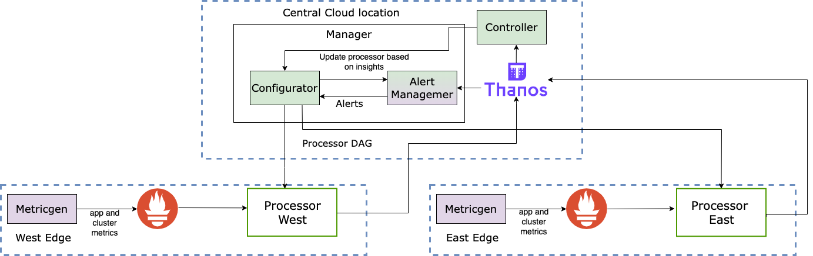

# PoC usecase


The PoC demonstrates two edges connected to a central cloud. Each edge comprises of metric generator whose metrics are scraped by prometheus. The prometheus does a remote write to thanos (running in the central cloud) for long term storage and analysis. The remote write is intercepted by our processor proxy running at each edge location. The processor applies various transformation to the collected metrics.

In this PoC we showcase how our controller generate insights that trigger pruning of metrics based on similarity across east and west edge/clouds.

## Environment Setup

The PoC requires docker installed on the machine to test the scenario. The following containers get installed when the PoC environment is bought up.\
Central containers:
- `thanos-receive`
- `thanos-query`
- `thanos-ruler`
- `ruler-config`
- `alertmanager`
- `controller`
- `manager`\
Edge containers:
- `metricgen1,2`
- `prometheus1,2`
- `pmf_processsor1,2`

## Running the PoC story

1. Bring up the PoC environment
``` 
docker-compose -f docker-compose-quay.yml up -d
```
2. Confirm the metrics are flowing correctly in the `thanos query` UI:
`http://0.0.0.0:19192/`\
Confirm metrics `k8s_pod_network_bytes or nwdaf_5G_network_utilization` are flowing correctly. There will be 1 of each in for both the edges hence 4 metrics.
3. Next, we trigger the controller to draw insights via the manager API. `http://0.0.0.0:5010/apidocs/#/Controller/post_api_v1_analyze`
4. To check the insights generated go to `http://0.0.0.0:5000/insights` and click on `Insights details 4`.\
   You will see it shows 3 metrics (`k8s_pod_network_bytes($app,c0,metricgen2:8001,west,$IP),nwdaf_5G_network_utilization(analytic_function,c0,metricgen1:8000,east,$IP),nwdaf_5G_network_utilization(analytic_function,c0,metricgen2:8001,west,$IP) `) are correlated to `k8s_pod_network_bytes`.
5. The insights can be used just as a recommendation or for full-automation where corresponding transform will be applied to each edge to handle the pruning. In this poc we will run in full automation mode. 
6. The controller triggers transformation in each cloud which can be seen using the manager UI. `http://0.0.0.0:5010/apidocs/#/Processor%20Configuration/getProcessorConfig`. Use `east` and `west` as the processor id to check transformation added to individual clouds. 
7. You can visualize the change in the metrics values (running query: `k8s_pod_network_bytes or nwdaf_5G_network_utilization`) in the `thanos query` UI (in the graph mode). You will see only `k8s_pod_network_bytes` with label ` processor="east"` flowing and other of the similar metrics being pruned/dropped.
8. To revert the transform and anlysis do `make compose_down`.

