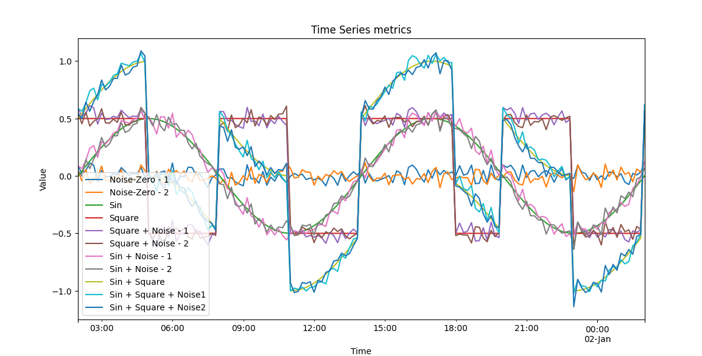

# generate-synthetic-metrics

> GitHub reference: [contrib/examples/generate-synthetic-metrics](https://github.com/observ-vol-mgt/observ-vol-mgt/tree/main/contrib/examples/generate-synthetic-metrics) 

This folder holds code that generates a fixed static set of metrics in prometheus API format.
The code generates a json file holding the metrics.
The file name is hard-coded `time_series_data.json`.
That file can be ingested into the controller component using `file ingest`.
For additional details, access the controller component documentation  




> The metrics, as shown above, are used for basic validation of the controller functionality based on simple predictable synthetic data.  

Execute using:  

```bash
python generate-synthetic-metrics.py
```

Note: To visualize the metrics (in a new window using pyplot) use `--plot` at the command line  


