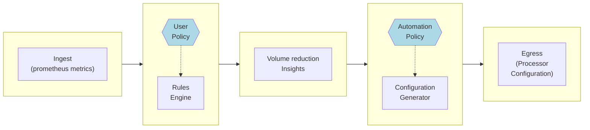

# Volume Manager Controller
## Architecture

The Volume Manager Controller is responsible for receiving information from the Observability Collectors and Observability Processors. It then performs a set of operations to contextualize and analyze this information. Along with the user-provided policies, the Controller generates insights and conducts automation operations to control and optimize the volume of observability data.  

The volume manager is built around pipelines of tasks that are executed asynchronously. Each task performs a different function and the pipelines are configurable to allow flexibility and support for various use cases.  

Tasks can be optimized and parallelized to enhance scalability and efficiency. Each task is classified based on its type, which determines its specific functionality and characteristics. The input and output data structures of each task differ from one another. The controller manages and arranges the tasks in Directed Acyclic Graphs (DAGs), and performs operations on them periodically and on-demand. The data ingestion into the controller is batched and processed between the various task operations.  

The controller requires data persistence to efficiently analyze observability data over time. Data persistence is decoupled from computing tasks, allowing flexibility for specific use cases.  

The controller's behavior is governed by a collection of high-level semantic policies that are visible to the user. This enables the controller to be managed based on intentions. The policies are analyzed by the controller and compared with the observed data to provide insights and configurations for handling the volume of observability data.  

## Task flows 

### Basic
For basic use cases, the volume manager controller tasks can be configured as follows:

<!---to edit mermaid flowcharts online use: https://mermaid.live/) 
--->  

>Note: In this MVP controller pipeline. The configuration of the controller uses a sub-set of the available tasks.

### Advanced

In advanced use cases, the tasks pipeline can be extended to provide additional capabilities. For example:

```mermaid
flowchart LR
    direction TB
    subgraph MetricsIngress[" "]
        direction TB
        MetricsIngress-Node["Ingest\n(prometheus signals)"]
    end
    subgraph LogsIngress[" "]
        direction TB
        LogsIngress-Node["Ingest\n(logs signals)"]
    end    
    subgraph Grouping[" "]
        direction TB
        Grouping-Policy{{"Grouping\nPolicy"}}
        Grouping-Policy:::policyclass
        Grouping-Node["Signal-Grouping\n(labels)"]
        Grouping-Policy-.->Grouping-Node        
    end     subgraph Features[" "]
        direction TB
        Features-Node["Features-Extraction\n(labels)"]
    end   
  
    subgraph ObserFeatures[" "]
        direction TB
        ObserFeatures-Node["Observability-Domain\nFeatures\n(Extra labels)"]
    end      
    subgraph User[" "]
        direction TB
        User-Policy{{"User\nPolicy"}}
        User-Policy:::policyclass
        User-Node["Rules\nEngine"]
        User-Policy-.->User-Node
    end
    subgraph Insights[" "]
        direction TB
        Insights-Node["Volume reduction\nInsights"]
    end   
    subgraph Automation[" "]
        direction TB
        Automation-Policy{{"Automation\nPolicy"}}
        Automation-Policy:::policyclass
        Automation-Node["Configuration\nGenerator"]
        Automation-Policy-.->Automation-Node
    end
    subgraph Egress[" "]
        direction TB
        Egress-Node["Egress\n(Processor\nConfiguration)"]
    end     
classDef policyclass fill:lightblue    
MetricsIngress --> Grouping --> Features --> ObserFeatures --> User --> Insights --> Automation --> Egress
LogsIngress --> Grouping
```

## Task types

Following are basic explanations for each of the task types:

| Task Type                          | Description                                                                                                                                                                                                                                                                                                                                                |
|------------------------------------|------------------------------------------------------------------------------------------------------------------------------------------------------------------------------------------------------------------------------------------------------------------------------------------------------------------------------------------------------------|
| Ingest                             | Ingest tasks are responsible for ingesting information into the controller. The objects ingested into the controller are “signals”. Signals can be each of the basic common observability data sources: metrics, logs, traces, etc. Signals can be ingested into the controller both synchronously and asynchronously.                                     |
| Grouping                           | Grouping tasks use data from the signals to cluster, group, and partition multiple signals into a `signal group`. The grouping rules are policy-driven and rely on meta-data and data from the signals. The clustering is  based on raw labels provided as part of the signals.                                                                            |
| Feature-Extraction                 | Feature Extraction tasks are responsible for the basic statistical analysis of the signals. They analyze the signal behaviors and produce a basic set of understandings of the signals.                                                                                                                                                                    |
| Observability-Analysis             | Observability analysis tasks are responsible for domain-specific analysis of signals generating observability-level understandings of signals                                                                                                                                                                                                              |
| User-Policy-Analyzer               | The policy enforcer will intersect the user-provided policies with the observability signals information and analysis gathered by the controller to generate policy driver information.                                                                                                                                                                    |
| System-Policy-Analyzer             | system policy analyzer tasks are responsible for the analysis of system behavior and the correlation of system risk analysis with the observability data. The  tasks will annotate the signals with relevant information to identify the dynamic applicability of the signals according to the policies                                                    |
| Signal-Insight                     | Insight tasks are responsible for the generation of volume management insights. Those insights are user-facing outputs of the pipelines and according to policies can be consumed by the users or pushed. The insights are tangible, environment-specific, and dynamic. They provide insights into volume management behaviors and action recommendations. |
| Automation/configuration generator | Automation tasks are responsible for the generation of per-processor configuration based on the action recommendation of the insights tasks. The configurations are sent using a customer-provided control plane to the processors to enforce the volume management reductions automatically.                                                              |

TBD:

Configurations  the configuration tasks are 

Feature extraction  feature 

Persistence:

Objects to consider:

